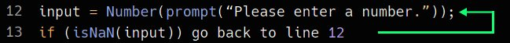
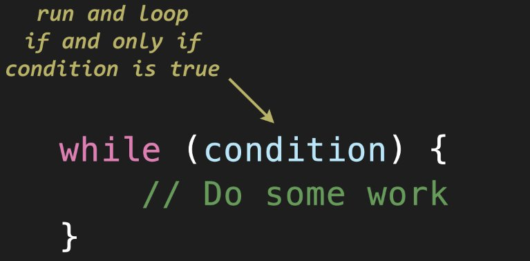

# Unit 3 - Conditionals and Loops

## 3.4 - While

##### ICS3 - Mr. Brash 🐿️


This lesson content is incomplete. Do **NOT** use it yet.

<table>
<tr>
<th>3.4 - In this Lesson:</th>
<th>Unit 3 - Conditionals & Loops</th>
</tr>
<tr>
<td td valign="top" style="height: 100px;padding-right:50px">

- [The `While` Loop](#lesson)
- [Examples](#examples)
- [Practice Time!](#practice-time)
    - [Part 1 - is_number](#part-1---is_number)
    - [Part 2 - Validate](#part-2---validate)
    - [Part 3 - Guess](#part-3---guess)
    
</td>
<td td valign="top" style="height: 100px;padding-right:50px">

- [README](../../README.md)
- [3.1 - If](../1%20-%20Conditionals/1%20-%20IF.md)
- [3.2 - Else-If](../1%20-%20Conditionals/2%20-%20Else-If.md)
- [3.3 - Else](../1%20-%20Conditionals/3%20-%20Else.md)
- [3.4 - While](./4%20-%20While.md)
- [3.5 - Interlude: `Strings`](./5%20-%20Interlude_Strings.md)
- [3.5 - Do...While](./6%20-%20Do-While.md)
- [3.6 - For](./7%20-%20For.md)

</td></tr></table>

---

### Lesson:

Repeating your code is inefficient. Also we might not know when it will end:
```JS
// Ask the user to enter a number and check for valid input
let input = Number(prompt(“Enter a number.”));

if (isNaN(input))
  input = Number(prompt(“Please enter a number.”));
    if (isNaN(input))
      input = Number(prompt(“Ugh, please enter a number.”));
        if (isNaN(input))
          input = Number(prompt(“Enter a NUMBER.”));
            if (isNaN(input))
              ... 
```

For this reason, programming languages have the ability to move back up to a specific line in the code. 


<div style="text-align:center;">
    <p>
        It's not as simple as saying "go back to line 12", but it's still pretty simple:
    </p>
    
</div>

**Think of the condition _just like an if-statement_!** The code will loop (repeat) and _continue_ to loop _if_ (or _while_) the condition is `true`. Let's look at some examples:

```JS
// Example: A never-ending loop (not good)
while (true) {
  console.log("You can't stop me!");
}

// Example: Counting to 10
let n = 0;
while (n <= 10) {
  console.log("n is", n);
  n++;  // We need to make sure we modify 'n'!
}

// Example: Should I stop?
let input = "n";
while (input != "y") {
  input = prompt("Should I stop? (y/n)").toLowerCase();
}
console.log("Ok, I stopped");
```

### Practice Time!

##### [Top ⬆](#34---while)

Create a new code environment / file in VSCode. (FILE > New Window **or** FILE > Open Folder). I recommend making a new folder called `Unit 3` and this first code file could be `3.1-While.js` or something similar.

The top of your file should have a `header`. Something like this:
```JS
/**
 * 3.1 - While Loops
 * Author: John Smith
 * 
 * Lesson link:  go.brash.ca/3U-3.1-While-Loops
 **/
```

You should also get used to using the `'use strict';` directive at the top of your code (you've seen this in previous assignments).

## Your Task:

Note - if you struggle with the functions below, see your teacher for simpler examples / tasks.

### Create the following three functions:
1. `countdown(start, stop)`: this function will count down from the `start` value to the `stop` value.
  - Check `start` and `stop` to make sure `start > stop`.
    - If not, return -1.
  - When the loop finishes, the function should _return_ the number of times it looped (how many numbers it printed).

    For Example:
    ```txt
    countdown(9, 4)
    9
    8
    7
    6
    5
    4
    6   << That's the return value (only visible if you use console.log())
    ```
<br>

2. `random_until(min, max, stop)`: this function will...
    - check that `max` is _greater_ than `min`. If not, return -1;
    - check that `stop` is between (or equal to) `min` and `max`. If not, return -1;
    - generate a random number from `min` to `max`. Print it to the console. 
      - _Repeat this process as long as the random number is not equal to_ `stop`;
    - return `stop`.

    You're going to need the `randInt()` function. Copy and paste it from here:
    ```JS
    // Return a random integer from min to max (inclusive)
    function randInt(min, max) {
      min = Math.ceil(min);
      max = Math.floor(max);
      return Math.floor(Math.random() * (max - min + 1) + min);
    }
    ```

<br>

3. `average(n)` - this function asks the user for `n` values and then calculates the average, not rounded. It should behave like this:
   ```txt
   > average(5)
   Please enter value 1/5 > 6
   Please enter value 2/5 > 4
   Please enter value 3/5 > 2
   Please enter value 4/5 > 4
   Please enter value 5/5 > 12
   The average is 5.6
   ```
    It is safe to assume proper input - _no need to check that it's a valid number_.

## Sir, this is too easy for me - I'm kinda bored in your class.

You have two things to learn that will greatly increase your abilities as a programmer:
- 2-dimmensional arrays. Python calls them _lists_ but most languages call them _arrays_. If you have not learned about arrays yet, start with 1-dimensional (normal) arrays. Then learn how 2D arrays work.
- HTML. Learn how to make websites with multiple pages and start diving into things like the `<div>` tag, `CSS`, and then get into `EventListener`. There are sooooo many tutorial sites or videos out there.

**I don't want to learn HTML**: Then make sure you know 2D-Arrays. Once you do, talk to Mr. Brash about the contest questions.

<br>

🐿️